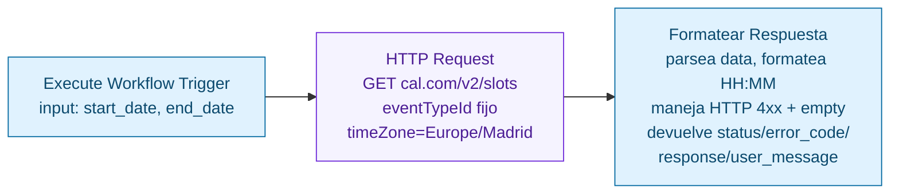
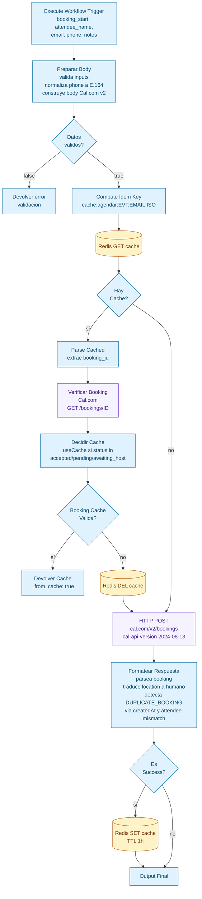
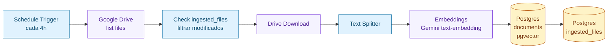

# 01 — Asistente Isabel (chat web)

Diagrama técnico completo del orquestador del widget Chatwoot + los 3 workflows satélite (RAG, Cal.com Disponibilidad, Cal.com Agendar).

## Orquestador: Chatwoot Widget

```mermaid
flowchart TD
    %% Entrada
    Chatwoot([Chatwoot inbox del agente]):::ext
    WH[Chatwoot Webhook<br/>POST entrada]:::node

    Chatwoot -->|webhook| WH
    WH --> FILT{Solo Mensajes<br/>Entrantes}

    %% Rama notificación inicial
    FILT -->|message_created<br/>o conversation_created| NOTIF_INCR[(Redis INCR<br/>convo_notified:CONV_ID<br/>TTL 7d)]:::store
    NOTIF_INCR --> NOTIF_PARSE[Parse Notify Flag]:::node
    NOTIF_PARSE --> NOTIF_IF{Es Primer<br/>Aviso?}
    NOTIF_IF -->|true| NOTIF_BUILD[Build Email Payload]:::node
    NOTIF_BUILD --> NOTIF_GMAIL[Gmail Notify<br/>Conversacion]:::ext
    NOTIF_IF -->|false| STOP1((stop))

    %% Filtro mensaje
    FILT -->|filtra| ESMSG{Es Mensaje?}
    ESMSG -->|sí| BUF[Buffer Mensaje]:::node
    ESMSG -->|no| STOP2((stop))

    %% Buffer con debounce 4s
    BUF --> RPUSH[(Redis RPUSH<br/>msgbuf:CONV_ID)]:::store
    RPUSH --> SETTS[(Redis SET<br/>msgbuf:CONV_ID:ts<br/>TTL 120s)]:::store
    SETTS --> W4[Esperar 4s]:::node
    W4 --> GETTS[(Redis GET ts)]:::store
    GETTS --> ULTIMO{Soy el<br/>Ultimo?}
    ULTIMO -->|no, llegó otro msg| STOP3((stop))
    ULTIMO -->|sí| LRANGE[(Redis LRANGE<br/>msgbuf:CONV_ID)]:::store
    LRANGE --> READBUF[Leer y Limpiar<br/>Buffer]:::node
    READBUF --> DELBUF[(Redis DEL<br/>msgbuf:CONV_ID)]:::store

    %% Rate limit
    DELBUF --> RL_INCR[(Redis INCR<br/>ratelimit:CONV_ID<br/>TTL 24h)]:::store
    RL_INCR --> RL_GETVER[(Redis GET<br/>verified:CONV_ID)]:::store
    RL_GETVER --> RL_CHECK[Rate Limit Check<br/>count>30 && !verified]:::node
    RL_CHECK --> BLOCKED{Esta<br/>Bloqueado?}
    BLOCKED -->|sí| HTTP_BLK[Enviar Mensaje<br/>Bloqueo Chatwoot<br/>link Cal.com 15min]:::ext
    HTTP_BLK --> STOP4((stop))

    BLOCKED -->|no| GET_PRE[GET Contacto Pre<br/>Chatwoot]:::ext

    %% AI Agent
    GET_PRE --> AGENT[[AI Agent<br/>Gemini flash<br/>maxIterations=8<br/>returnIntermediateSteps]]:::agent

    %% Conexiones ai_* del agent
    MEM[Redis Chat Memory<br/>memoryRedisChat]:::node
    LLM[Google Gemini<br/>flash]:::ext
    TOOL_RAG[Base de Conocimiento<br/>Wattify · toolVectorStore]:::tool
    TOOL_DISP[Consultar Disponibilidad<br/>CalCom · toolWorkflow]:::tool
    TOOL_AG[Agendar Reunion<br/>CalCom · toolWorkflow]:::tool

    LLM -. ai_languageModel .-> AGENT
    MEM -. ai_memory .-> AGENT
    TOOL_RAG -. ai_tool .-> AGENT
    TOOL_DISP -. ai_tool .-> AGENT
    TOOL_AG -. ai_tool .-> AGENT

    %% Subgrafo vector store del tool RAG
    subgraph RAG_TOOL["Tool: Base de Conocimiento (RAG en runtime)"]
      direction TB
      PG[Postgres PGVector<br/>tableName=documents]:::node
      EMB[Embeddings<br/>Google Gemini]:::ext
      LLM2[Gemini flash<br/>Chat Model2]:::ext
      EMB -. ai_embedding .-> PG
      LLM2 -. ai_languageModel .-> TOOL_RAG
      PG -. ai_vectorStore .-> TOOL_RAG
    end

    %% Tools que disparan sub-workflows
    TOOL_DISP -. executeWorkflow .-> SUBW_DISP[/Sub-workflow<br/>Cal.com Disponibilidad/]:::subwf
    TOOL_AG -. executeWorkflow .-> SUBW_AG[/Sub-workflow<br/>Cal.com Agendar/]:::subwf

    %% Salida del agent → Guard determinista
    AGENT --> GUARD[Guard Respuesta Agente<br/>parsea intermediateSteps<br/>override si tool=error o<br/>output vacío]:::node

    %% Guard fanout: 4 ramas paralelas
    GUARD --> BR1[Detectar Datos Cliente]:::node
    GUARD --> BR2[Redis GET<br/>Chat History]:::store
    GUARD --> BR3[Detectar Booking<br/>Exitosa]:::node
    GUARD --> BR4[Build Turn Log]:::node

    %% Rama 1: enviar mensaje a Chatwoot + verificar usuario
    BR1 --> SEND[Enviar Mensaje<br/>Chatwoot]:::ext
    SEND --> NEWDATA{Tiene Datos<br/>Nuevos?}
    NEWDATA -->|true| SETVER[(Redis SET<br/>verified:CONV_ID<br/>TTL 24h)]:::store
    NEWDATA -->|false| STOP5((stop))

    %% Rama 2: Information Extractor + actualizar Chatwoot
    BR2 --> BUILDCONV[Build Conversation<br/>Text]:::node
    BUILDCONV --> EXTRACT[[Information Extractor<br/>schema: first_name, last_name,<br/>email, phone_e164, tipo_cliente,<br/>gasto_mensual_eur, codigo_postal,<br/>intereses]]:::agent
    EXT_LLM[Gemini flash<br/>Extractor Model]:::ext
    EXT_LLM -. ai_languageModel .-> EXTRACT
    EXTRACT --> PARSE_EXT[Parse Extraction]:::node
    PARSE_EXT --> HAS_DATA{Hay Datos<br/>Extraidos?}
    HAS_DATA -->|true| GET_CONTACT[GET Contacto<br/>Chatwoot]:::ext
    GET_CONTACT --> COMP_UPD[Calcular Update Body<br/>diff vs Chatwoot actual]:::node
    COMP_UPD --> HAS_CH{Hay Cambios?}
    HAS_CH -->|true| PATCH[PATCH Contacto<br/>Chatwoot]:::ext
    PATCH --> IF422{PATCH<br/>422?}
    IF422 -->|true · email duplicado| SEARCH[Buscar Contacto<br/>Por Email]:::ext
    SEARCH --> PREP_MERGE[Prep Merge Body]:::node
    PREP_MERGE --> MERGE[POST Merge<br/>Contacts]:::ext
    IF422 -->|false| STOP6((stop))

    %% Rama 3: detectar booking exitosa → email cita
    BR3 --> BK_INCR[(Redis INCR<br/>booking_notified:BID<br/>TTL 30d)]:::store
    BK_INCR --> BK_PARSE[Parse Booking Notify]:::node
    BK_PARSE --> BK_FIRST{Es Primer<br/>Aviso Booking?}
    BK_FIRST -->|true| W5[Esperar 5s]:::node
    W5 --> GET_FINAL[GET Contacto Final]:::ext
    GET_FINAL --> GET_HIST[(Redis GET<br/>chat history)]:::store
    GET_HIST --> BUILD_BK[Build Email Booking<br/>Payload<br/>transcript+contacto+cita]:::node
    BUILD_BK --> GMAIL_BK[Gmail<br/>Cita Reservada]:::ext

    %% Rama 4: log de turno en Postgres
    BR4 --> INS[(Postgres INSERT<br/>agent_turn_logs)]:::store

    %% Estilos
    classDef node fill:#e0f2fe,stroke:#0369a1,color:#0c4a6e
    classDef agent fill:#fef9c3,stroke:#ca8a04,color:#713f12,stroke-width:2px
    classDef tool fill:#fce7f3,stroke:#be185d,color:#831843
    classDef store fill:#fef3c7,stroke:#b45309,color:#78350f
    classDef ext fill:#f5f3ff,stroke:#6d28d9,color:#4c1d95
    classDef subwf fill:#dcfce7,stroke:#15803d,color:#14532d
```

## Sub-workflow: Cal.com Disponibilidad

Llamado como tool por el AI Agent. Devuelve los slots libres en formato estructurado.

## Sub-workflow: Cal.com Agendar

Llamado como tool por el AI Agent. Implementa **idempotencia con Redis** para no duplicar reservas si el agente reintenta.

## Sub-workflow: RAG (cron 4h)

Ingesta documentos de Google Drive y los indexa en PGVector. Llamado en runtime por el `toolVectorStore` del orquestador.

> Nota: el diagrama del RAG es esquemático; la implementación real incluye splitting + dedupe + ventana de modificación, fuera del alcance de este resumen visual.

## Detalles operativos clave

| Concepto | Implementación |
|---|---|
| **Debounce de mensajes rápidos** | `RPUSH` a `msgbuf:CONV_ID` + `SET` de `ts` único + `WAIT 4s` + comparación de timestamps. Solo el último mensaje en la ventana de 4s continúa. |
| **Memoria conversacional** | `memoryRedisChat` con `sessionKey=conversationId`. Persiste turnos en formato `{type: human|ai, data:{content}}`. |
| **Rate limit anti-abuso** | Counter por sesión en `ratelimit:CONV_ID` (TTL 24h). Si `count > 30 && !verified`, se bloquea y se envía link de Cal.com. Marcar como `verified` cuando se extraen datos válidos. |
| **Guard anti-alucinación** | Code node post-AI Agent que parsea `intermediateSteps`. Si `agendar_reunion` devolvió `status=error`, fuerza `output = user_message`. Si `status=success` pero el output no contiene clue (booking_id, fecha o hora en TZ Madrid), también override. Si output vacío, fallback humano. |
| **Idempotencia de bookings** | Cache Redis con clave `cache:agendar:EVT:EMAIL:ISO` (TTL 1h). Si Cal.com devuelve 201 con booking pre-existente, el formatter detecta `createdAt > 60s` o `attendee mismatch` y responde con `DUPLICATE_BOOKING`. |
| **Resolución de email duplicado en Chatwoot** | Si el PATCH al contacto devuelve 422, se busca el contacto que tiene el email, y se hace `POST /actions/contact_merge` con el viejo como base y el actual como mergee. |
| **Auditoría** | Cada turno escribe una fila en `agent_turn_logs` con `execution_id`, `latency_ms`, `tools_used`, `guard_log`, `has_booking`, `error_path`. Pensado para post-mortem y métricas. |
