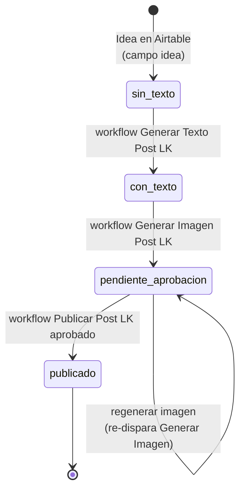
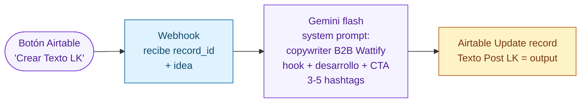
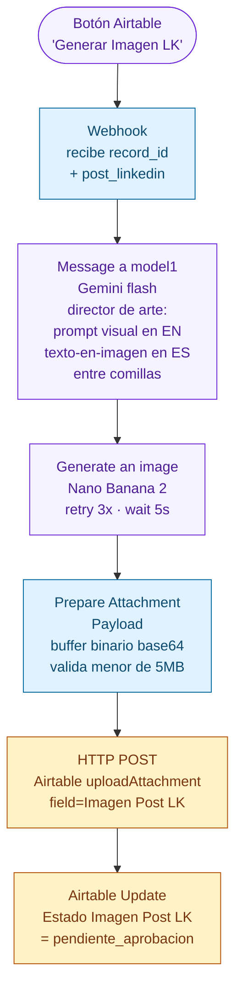
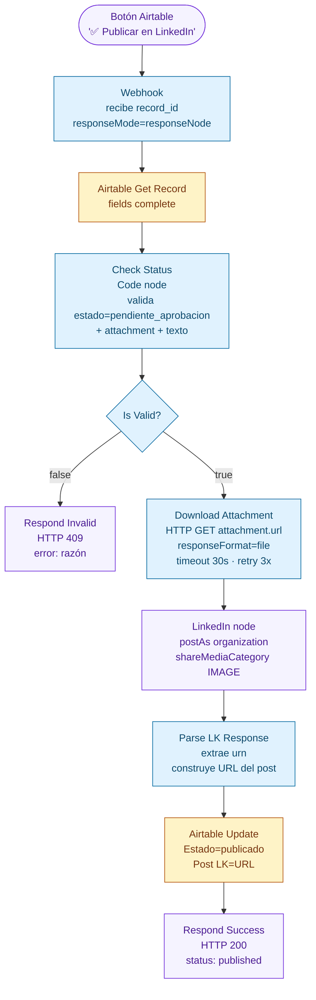

# 02 — Pipeline RRSS LinkedIn

Pipeline que cubre la generación de texto, generación de imagen, aprobación humana y publicación de un post en LinkedIn como organización. Orquestado desde Airtable (base RRSS).

## Estado y máquina de transiciones

## 1. Generar Texto Post LK

**Respuesta inmediata al webhook**: `"¡Texto enviado a procesar! Puedes cerrar esta pestaña y volver a Airtable."`

## 2. Generar Imagen Post LK

Dos pasos LLM en cadena: primero un Gemini flash que actúa de director de arte y redacta el **prompt visual en inglés** a partir del texto del post, y después un modelo de imagen (Nano Banana 2) que genera la imagen.

**Respuesta inmediata al webhook**: `"¡Imagen en proceso! En unos segundos la verás en Airtable lista para aprobar."`

Al terminar, el editor humano abre la vista filtrada por `Estado Imagen Post LK = pendiente_aprobacion` y decide si **aprobar** (botón "✅ Publicar en LinkedIn") o **regenerar** (vuelve a disparar este mismo webhook).

## 3. Publicar Post LK aprobado

Workflow disparado solo desde el botón Airtable de aprobación. Valida estado, descarga el attachment, publica en LinkedIn como organización y marca como `publicado`.

## Notas operativas

- El estado `pendiente_aprobacion` actúa como **lock pesimista**. Solo se puede publicar desde ese estado; cualquier otro devuelve 409.
- El paso `Parse LK Response` busca el URN del post en múltiples ubicaciones (`r.id`, `r.urn`, `r.activity`, `r.headers['x-restli-id']`, `r.headers['x-linkedin-id']`, `r.body.id`, `r.body.urn`) porque la API de LinkedIn lo devuelve en sitios distintos según versión y endpoint.
- El `Marcar Publicado` tiene `onError: continueRegularOutput` para que aunque Airtable falle al actualizar, el cliente vea la respuesta HTTP 200 (el post ya está publicado, no se puede deshacer).
- El campo `Imagen Post LK` es de tipo attachment de Airtable. La subida usa el endpoint `uploadAttachment` con el body codificado en base64.
- Diferencia con la primera versión del flujo: hasta el 2026-05-26 había un único workflow que generaba imagen **y** publicaba. Se separó en dos para introducir la aprobación humana intermedia.
