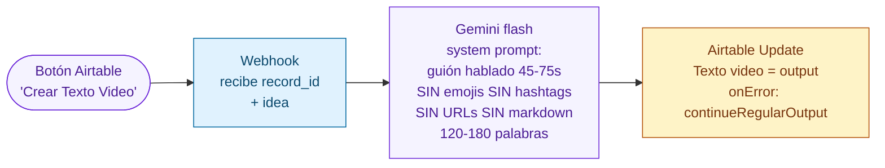
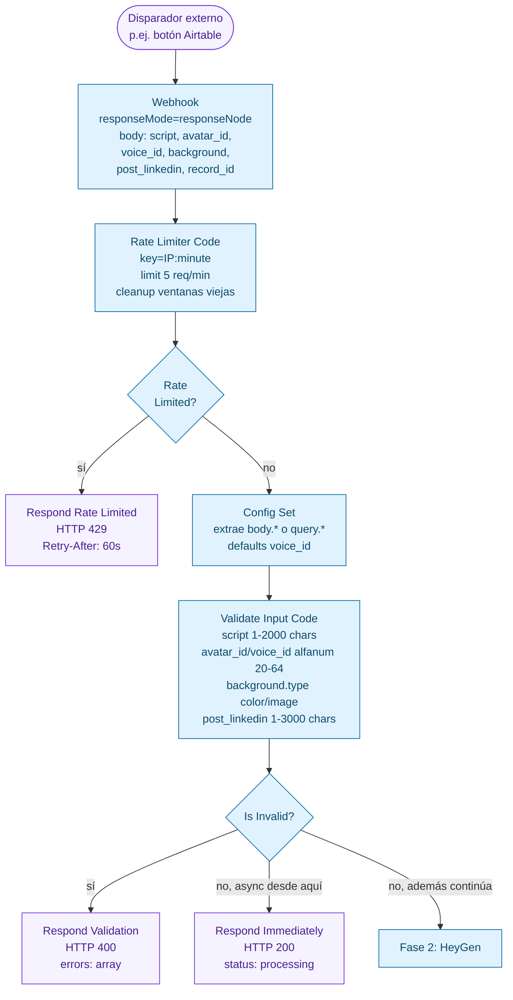
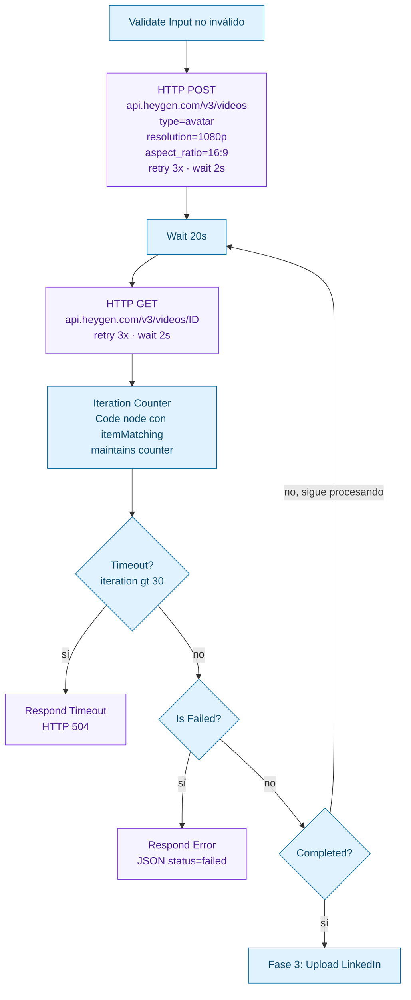

# 03 — Pipeline RRSS Video

Dos workflows: uno simple para generar el guión hablado, y uno mucho más complejo (`Avatar Video v3`) que orquesta HeyGen + upload chunked a LinkedIn + publicación + actualización en Airtable.

## 1. Crear texto video

## 2. Avatar Video v3

Es el workflow más complejo del pipeline RRSS. Tiene **rate limiting por IP**, **validación estricta**, **respuesta inmediata** mientras el resto corre asíncrono, **polling con timeout** del job HeyGen, y un **upload multipart real** a LinkedIn vía `https.request` nativo en Code node.

### Fase 1: Entrada, rate limit y validación

> Tras `Respond Immediately` el cliente HTTP recibe respuesta y cuelga. El resto del workflow sigue corriendo en background hasta `Respond`, que ya no llega al cliente original.

### Fase 2: Generación HeyGen + polling

### Fase 3: Download + upload chunked a LinkedIn

LinkedIn requiere upload multipart con `initializeUpload → PUT chunks → finalizeUpload`. El workflow descarga el video de HeyGen, lo trocea según las `uploadInstructions` que devuelve LinkedIn, y sube cada chunk con su `Content-Range`.

```mermaid
flowchart TD
    DONE[Completed?<br/>video_url disponible]:::node
    DL[Download Video<br/>HTTP GET video_url<br/>responseFormat=file<br/>retry 3x]:::node
    INIT[Initialize LK Upload<br/>POST videos?action=initializeUpload<br/>LinkedIn-Version<br/>owner=organización<br/>fileSizeBytes=binary.bytes<br/>retry 2x]:::ext
    PREP[Prepare Chunks Code<br/>itera uploadInstructions<br/>1 output item por chunk<br/>con uploadUrl + Range]:::node
    FETCH[Fetch Chunk<br/>HTTP GET video_url<br/>header Range: bytes=A-B<br/>timeout 60s · retry 2x]:::node
    UPLOAD[Upload All Chunks<br/>Code con require https/url<br/>PUT a cada uploadUrl<br/>extrae ETag de headers<br/>throw si status 3xx o sin etag]:::node
    FIN[Finalize Upload<br/>POST videos?action=finalizeUpload<br/>uploadedPartIds=etags<br/>retry 2x]:::ext

    WAITLK[Wait LK Processing<br/>30s espera transcoding]:::node
    POST[Create LK Post<br/>POST rest/posts<br/>content.media.id=video_urn<br/>commentary=post_linkedin<br/>fullResponse=true<br/>retry 2x]:::ext
    UPD_AT[Airtable Update<br/>se ha subido Video=true<br/>Video Linkedin=URL]:::store
    R_OK[Respond<br/>JSON con video_url<br/>linkedin.post_urn<br/>linkedin.post_url]:::ext

    DONE --> DL --> INIT --> PREP --> FETCH --> UPLOAD --> FIN --> WAITLK --> POST --> UPD_AT --> R_OK

    classDef node fill:#e0f2fe,stroke:#0369a1,color:#0c4a6e
    classDef store fill:#fef3c7,stroke:#b45309,color:#78350f
    classDef ext fill:#f5f3ff,stroke:#6d28d9,color:#4c1d95
```

## Detalles operativos clave

| Concepto | Implementación |
|---|---|
| **Rate limit por IP** | Code node `Rate Limiter` mantiene un mapa `IP:minuto → count` en `$getWorkflowStaticData('global')._rate`. Limpia ventanas de más de 5 min al pasar. Hard limit 5 req/min/IP. |
| **Fire-and-forget para el cliente HTTP** | `Respond Immediately` se ejecuta en paralelo con `HeyGen Create Video`. El cliente original ya tiene HTTP 200, pero el workflow sigue. Los `Respond Error / Timeout` posteriores no llegan a nadie excepto a la ejecución en n8n. |
| **Polling con timeout** | `Wait 20s` + `Poll Video Status` + `Iteration Counter`. Máximo 30 iteraciones ≈ 10 minutos. Tras eso devuelve `status: timeout`. |
| **Upload chunked manual** | `Upload All Chunks` usa `require('https')` directamente porque el nodo HTTP de n8n no permite mantener el `Content-Length` exacto que LinkedIn exige. Recoge cada `ETag` y los pasa a `finalizeUpload` como `uploadedPartIds`. |
| **URN del post** | LinkedIn devuelve el URN del post en el header `x-restli-id` (o `x-linkedin-id` según versión). El `Respond` final lo extrae para devolverlo en el JSON de salida. |
| **Persistencia de la ejecución** | `saveExecutionProgress: true` y `executionTimeout: 900s`. La ejecución se conserva durante 15 min incluso si n8n se reinicia, para no perder el polling. |
