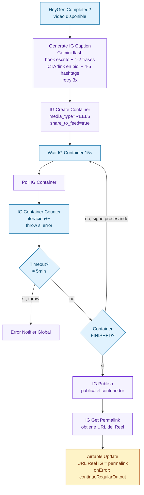

# 04 — Pipeline RRSS Instagram Reels

Dos workflows que extienden el pipeline RRSS a **Instagram Reels** (vídeo vertical 9:16). Replican el patrón de Video LinkedIn (guión → avatar HeyGen → publicación), pero con dos diferencias clave: el vídeo se genera en **9:16 con subtítulos quemados**, y la publicación va por la **Instagram Graph API** con su flujo de tres pasos (crear contenedor REELS → polling → publicar). Disparados desde botones de Airtable, escriben el resultado de vuelta en Airtable.

## 1. Generar Texto Reel IG

Genera el guión hablado del Reel con un tono específico de Instagram (hook brutal en los primeros 2s, frases muy cortas, sin URLs ni hashtags en el audio).

```mermaid
flowchart LR
    AT_BTN([Botón Airtable<br/>"Generar Texto Reel IG"]):::ext
    WH[Webhook<br/>recibe record_id<br/>+ idea]:::node
    GEMINI[Gemini flash<br/>prompt IG Reels:<br/>hook brutal 2s<br/>frases muy cortas<br/>60-100 palabras ≈ 25-40s<br/>SIN URLs SIN emojis SIN hashtags<br/>retry 3x]:::ext
    UPD[Airtable Update<br/>Texto Reel IG = output<br/>onError: continueRegularOutput]:::store

    AT_BTN --> WH --> GEMINI --> UPD

    classDef node fill:#e0f2fe,stroke:#0369a1,color:#0c4a6e
    classDef store fill:#fef3c7,stroke:#b45309,color:#78350f
    classDef ext fill:#f5f3ff,stroke:#6d28d9,color:#4c1d95
```

## 2. Generar y Publicar Reel IG

Workflow fire-and-forget que toma el guión de Airtable, genera el avatar en HeyGen 9:16 con subtítulos quemados, escribe una descripción específica para el post con Gemini, y publica el Reel vía Instagram Graph API con **doble polling** (job de HeyGen + contenedor de IG). Acepta el avatar y la voz como parámetros para permitir dos "trajes" desde sendos botones de Airtable.

### Fase 1: Entrada + generación HeyGen 9:16 con polling

```mermaid
flowchart TD
    AT_BTN([Botón Airtable<br/>"Generar Reel IG traje 1/2"]):::ext
    WH[Webhook<br/>recibe record_id<br/>+ avatar + voz]:::node
    GET[Get Record Airtable<br/>lee Texto Reel IG]:::store
    HG_POST[HeyGen Create Video<br/>aspect_ratio=9:16<br/>subtítulos quemados<br/>retry · wait]:::ext

    WAIT_HG[Wait HeyGen 30s]:::node
    POLL_HG[Poll HeyGen Status]:::ext
    CNT_HG[HeyGen Counter<br/>iteración++<br/>throw si fallo]:::node
    TO_HG{Timeout?<br/>≈ 15min}
    DONE_HG{Completed?}
    ERR[Error Notifier Global]:::ext

    AT_BTN --> WH --> GET --> HG_POST --> WAIT_HG --> POLL_HG --> CNT_HG --> TO_HG
    TO_HG -->|sí, throw| ERR
    TO_HG -->|no| DONE_HG
    DONE_HG -->|no, sigue procesando| WAIT_HG
    DONE_HG -->|sí| F2[Fase 2: Publicación IG]:::node

    classDef node fill:#e0f2fe,stroke:#0369a1,color:#0c4a6e
    classDef store fill:#fef3c7,stroke:#b45309,color:#78350f
    classDef ext fill:#f5f3ff,stroke:#6d28d9,color:#4c1d95
```

> Con subtítulos quemados, el vídeo final viene en una URL distinta a la del vídeo sin subtítulos. El siguiente paso usa la versión con subtítulos como prioridad.

### Fase 2: Caption IG + publicación Instagram Graph API

Instagram exige un flujo de tres pasos: crear el contenedor REELS, esperar a que termine de procesar el vídeo (polling), y solo entonces publicar. El caption del post se genera aparte con Gemini (distinto al audio) y se posiciona **después** del polling de HeyGen para no consumir tokens si el vídeo falla.



## Detalles operativos clave

| Concepto | Implementación |
|---|---|
| **Vertical 9:16** | HeyGen genera el vídeo en `9:16` (frente al `16:9` del vídeo de LinkedIn). Por eso es un workflow paralelo y no una rama del de vídeo LK. |
| **Subtítulos quemados** | HeyGen quema los subtítulos directamente en el vídeo, en vez de devolver un fichero de subtítulos aparte. |
| **Doble polling con counter** | Dos bucles `Wait → Poll → Counter → IF`. HeyGen: timeout ≈ 15 min. Contenedor IG: timeout ≈ 5 min. Cada counter corta ante un estado terminal de error, lo que dispara el Error Notifier Global. |
| **Dos "trajes" desde un solo workflow** | El webhook recibe el avatar y la voz como parámetros, con un valor por defecto. Dos botones de Airtable (`traje 1` y `traje 2`) usan el mismo workflow cambiando sólo el avatar. |
| **Caption IG ≠ audio** | El caption del post (texto escrito + CTA + hashtags) se genera aparte y es distinto del guión hablado. Se calcula después del polling de HeyGen para no consumir tokens si el vídeo nunca llega a completarse. |
| **Fire-and-forget** | No hay paso de aprobación humana (a diferencia de la imagen de LinkedIn). El botón dispara y el Reel se publica directo. |
| **Persistencia de la ejecución** | La ejecución se conserva hasta 15 min incluso si el sistema se reinicia, para no perder el doble polling. |
